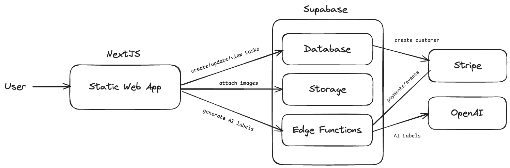

# Project Mosaic: Template Design

Project Mosaic is a framework for rapidly developing multiple micro-SaaS products. This document outlines the architecture and design principles of the template that serves as the foundation for all products built within Project Mosaic.



## Core Architecture

The template is built on a modern stack optimized for rapid development and scalability:

- **Frontend**: Next.js with React and Tailwind CSS
- **Backend/Database**: Supabase (PostgreSQL, Authentication, Storage)
- **Deployment**: Vercel
- **Payments**: Stripe
- **Analytics**: Plausible/Google Analytics
- **AI Integration**: Provider-agnostic interfaces for multiple AI services

## Template Features

| Feature                | Description                                                      | Technology                |
|------------------------|------------------------------------------------------------------|---------------------------|
| Authentication         | Email/password and social login                                  | Supabase Auth             |
| User Management        | Profile creation and management                                  | Database + Triggers       |
| Subscription System    | Tiered pricing with free and premium plans                       | Stripe + DB Triggers      |
| Storage                | Secure file uploads with access control                          | Supabase Storage          |
| AI Integration         | Provider-agnostic AI service layer                               | Edge Functions            |
| Usage Tracking         | Monitor and limit resource usage based on subscription           | DB Triggers               |
| White-labeling         | Customizable branding and theming                                | Tailwind + Config System  |
| Analytics              | User behavior and conversion tracking                            | Analytics Hooks           |

## Data Model

### Core Tables

#### Profiles Table

| Column             | Type    | Description                            |
|--------------------|---------|-----------------------------------------|
| user_id            | uuid    | Primary key, references auth.users(id)  |
| name               | text    | User's display name                     |
| subscription_plan  | text    | User's plan (free/premium)              |
| usage_limit        | integer | Resource usage limit based on plan      |
| stripe_customer_id | text    | Stripe customer identifier              |

#### Usage Tracking Table

| Column        | Type    | Description                              |
|---------------|---------|------------------------------------------|
| user_id       | uuid    | Foreign key to profiles.user_id          |
| year_month    | text    | Month of tracking (YYYY-MM format)       |
| usage_count   | integer | Number of resources used in current month|

### Product-Specific Tables

Each product will extend the core data model with its own tables. For example, a content calendar might add:

```sql
CREATE TABLE public.content_items (
  item_id UUID PRIMARY KEY DEFAULT uuid_generate_v4(),
  user_id UUID REFERENCES public.profiles(user_id) ON DELETE CASCADE,
  title TEXT NOT NULL,
  content TEXT,
  status TEXT DEFAULT 'draft',
  scheduled_date TIMESTAMP WITH TIME ZONE,
  created_at TIMESTAMP WITH TIME ZONE DEFAULT now(),
  updated_at TIMESTAMP WITH TIME ZONE DEFAULT now()
);
```

## Subscription Model

The template includes a complete subscription system with:

- Free tier with usage limits
- Premium tier(s) with higher limits
- 14-day trial period for premium features
- Automated subscription lifecycle management
- Customer portal for subscription management

## Edge Functions

| Function                  | Description                                                   |
|---------------------------|---------------------------------------------------------------|
| create-stripe-session     | Creates checkout/portal sessions for subscription management  |
| list-subscription-plans   | Returns available subscription plans and pricing              |
| stripe-webhook            | Processes Stripe events (subscriptions, payments, etc.)       |
| ai-service                | Provider-agnostic AI service endpoint                         |

## Customization System

The template is designed to be easily customized for different product types through:

1. **Configuration Files**: Central configuration for product-specific settings
2. **Theme System**: Customizable colors, typography, and layout
3. **Feature Flags**: Toggle features on/off without code changes
4. **Content Management**: Easily update marketing copy and product information

## Development Workflow

Project Mosaic enables a rapid development workflow:

1. **Fork Template**: Start with the base template
2. **Configure Product**: Set product name, branding, and subscription tiers
3. **Add Product Tables**: Create database schema for product-specific data
4. **Implement Features**: Build product-specific functionality
5. **Deploy**: Launch on Vercel with Supabase backend
6. **Iterate**: Collect feedback and improve

This template serves as the foundation for building 6-9 profitable micro-SaaS products over a 12-week period, with the goal of generating $3,000+ in monthly recurring revenue.
